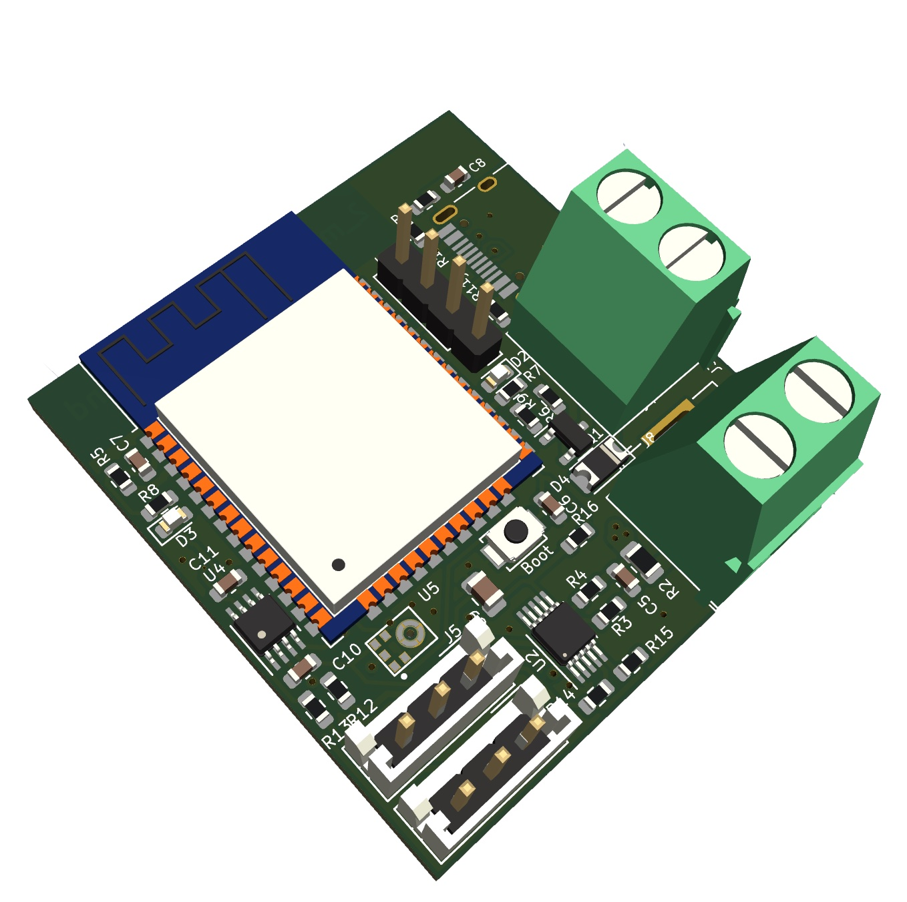

# ESP32_minimal_WLED_sound

 Either install WLED and configure Digital LEDs on GPIO 2 and 4 with following functions:
 - 2 channels for Digital LEDs
 - 1 mosfet switch output
 - sound reactive with microphone
 
 or install ESPHome to have full support of following:
 - 2 channels for Digital LEDs
 - 1 mosfet switch output
 - INA226 current sensing

# ESPHome ESP32 Sound Module WebInstaller

ESPHome Configuration:

It includes a GitHub workflow that will automatically build the configuration(s) and then deploys a simple 
website via GitHub pages that utilises [ESP Web Tools](https://esphome.github.io/esp-web-tools/) for users to 
easily install your project onto their device.

## Instructions
Open: [https://yannik25.github.io/ESP32_minimal_WLED_sound/](https://yannik25.github.io/ESP32_minimal_WLED_sound/) and follow instructions.
